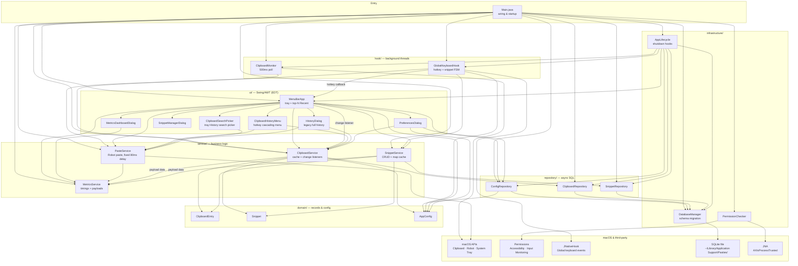
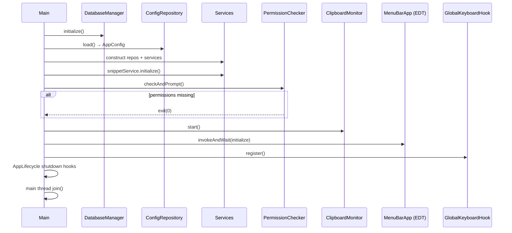
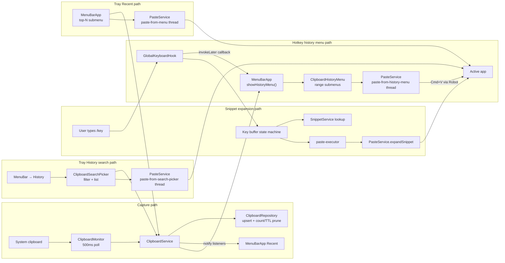
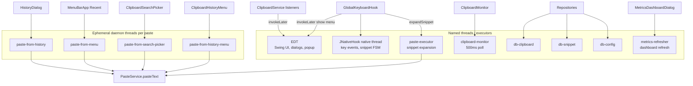
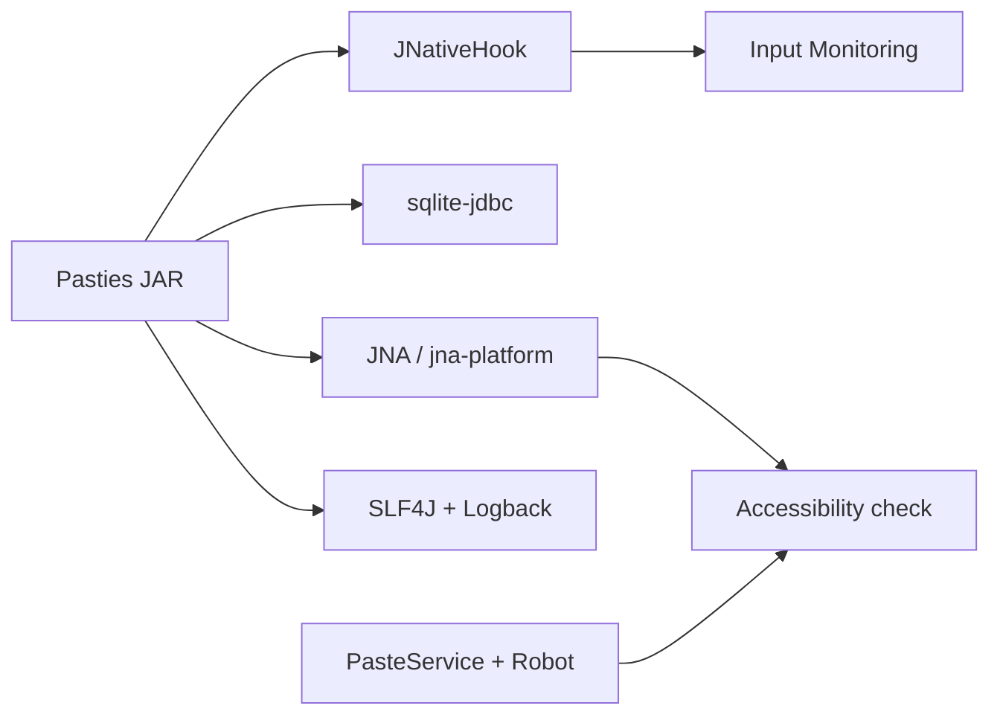

# Pasties

A lightweight macOS clipboard manager written in Java, inspired by [Clipy](https://github.com/clipy/clipy).

Pasties lives in your menu bar, keeps a searchable history of everything you've copied, and lets you define text snippets that expand automatically when you type `/{key}` in **any** application on your Mac.

---

## Features

| Feature | Description |
|---|---|
| **Clipboard history** | Stores up to 300 text entries (configurable). Deduplicated by content hash. TTL-pruned (default 90 days). |
| **Global hotkey history menu** | Press **Ctrl+Shift+V** or **⌘+Shift+V** to open a Clipy-style cascading history menu grouped as `1 - 10`, `11 - 20`, and so on. |
| **Searchable history picker** | Open **History** from the menu bar to search recent clipboard entries and paste by selection. |
| **Snippet expansion** | Type `/addr` in any app and it instantly expands to your saved text. |
| **Performance dashboard** | Live metrics: paste speed, snippet expansion speed, memory, CPU, DB size, and payload sizes. |
| **Menu bar app** | No Dock icon. Everything accessible from the system tray. |
| **Persistent storage** | SQLite database at `~/Library/Application Support/Pasties/pasties.db`. |

---

## Requirements

| Dependency | Version | How to install |
|---|---|---|
| Java | 21 (JDK) | `brew install openjdk@21` |
| Maven | 3.9+ | `brew install maven` |
| macOS | 13 Ventura or later | — |

> **Apple Silicon (arm64) is supported.** The SQLite JDBC driver bundles a native arm64 binary.

---

## Quick Start

```bash
# 1. Clone or download the project
cd /Users/ajaymeghna/Projects/pasties

# 2. Build the fat JAR
mvn package -q

# 3. Run
java -Dapple.awt.UIElement=true -Xmx64m -jar target/pasties-1.0.0.jar
```

On first launch, Pasties will check for the two required macOS permissions and open System Settings automatically if either is missing.

### Granting permissions (one-time setup)

1. **Input Monitoring** — required for the global keyboard hook (snippet detection, hotkey).
   `System Settings → Privacy & Security → Input Monitoring → Add Pasties`

2. **Accessibility** — required for simulating keystrokes (paste, backspace).
   `System Settings → Privacy & Security → Accessibility → Add Pasties`

After granting both permissions, restart Pasties.

---

## Building a macOS App Bundle

For local development, the easiest full reinstall flow is:

```bash
scripts/reinstall-and-run.sh
```

This stops any running Pasties instance, removes old build output and `/Applications/Pasties.app`, runs tests, rebuilds the fat JAR, creates a fresh app bundle, ad-hoc signs it, installs it to `/Applications`, resets macOS Accessibility/Input Monitoring approval state, refreshes the signature, and launches it.

Useful options:

```bash
scripts/reinstall-and-run.sh --skip-tests
scripts/reinstall-and-run.sh --no-launch
```

```bash
# 1. Package the fat JAR
mvn package -q

# 2. Bundle with jpackage (requires JDK 21 jpackage on PATH)
jpackage \
  --input target \
  --main-jar pasties-1.0.0.jar \
  --main-class com.pasties.Main \
  --name Pasties \
  --type app-image \
  --dest target/dist \
  --icon src/main/resources/icon.icns \
  --java-options "-Xmx64m -Dapple.awt.UIElement=true" \
  --mac-package-name Pasties \
  --mac-package-identifier com.pasties
```

The resulting `target/dist/Pasties.app` can be moved to `/Applications`.

---

## Usage

### Clipboard history menu

Press **Ctrl+Shift+V** or **⌘+Shift+V** in any application to open a Clipy-style history menu at the cursor.

- **History ranges** — open grouped submenus such as `1 - 10` and `11 - 20`
- **Clipboard item** — click any item to paste it into the previously active app
- **Clear History** — remove all saved clipboard entries
- **Edit Snippets... / Preferences... / Quit Pasties** — available directly from the hotkey menu

### Searchable history picker

Click **History** in the menu bar to open the searchable picker. It loads recent entries from the database, filters as you type, and pastes the selected item with Enter or double-click.

### Snippet expansion

1. Open the **Snippets** dialog from the menu bar icon.
2. Click **Add** and enter a key (e.g. `addr`) and a value (e.g. `123 Main St, City, State`).
3. In any application, type `/addr` — Pasties erases `/addr` and types your snippet value automatically.

**Key rules:**
- Keys must match `[a-zA-Z0-9_-]+` (letters, digits, dashes, underscores).
- The prefix character is `/` by default (configurable in the database).

### Menu bar

| Menu item | Action |
|---|---|
| **Recent** | Shows the latest clipboard entries for quick mouse-based paste (configured by `recent_menu_size`, default 10). |
| **History** | Open the searchable clipboard picker. |
| **Snippets** | Open the snippet manager to add, edit, or delete snippets. |
| **Performance Dashboard** | Open the live metrics dashboard. |
| **Preferences** | Configure history size, page sizes, TTL, hotkey, and start-on-login. |
| **Quit Pasties** | Gracefully shut down the app. |

---

## Performance Dashboard

Open via **Performance Dashboard** in the menu bar. Refreshes automatically every 2 seconds.

| Metric | Description |
|---|---|
| Avg paste speed (ms) | Wall-clock time per clipboard history paste |
| Total pastes | Paste operations recorded this session |
| Avg snippet expansion (ms) | Wall-clock time per snippet expansion (backspaces + paste) |
| Total snippet expansions | Expansion operations recorded this session |
| JVM heap used | Current Java heap allocation |
| Process CPU load | Pasties's JVM CPU usage percentage |
| DB file size | SQLite database size on disk |
| Clipboard payload | Total UTF-8 bytes of cached clipboard entries |
| Snippet payload | Total UTF-8 bytes of all snippet values |

---

## Configuration

All settings are stored in the SQLite `config` table and editable via **Preferences** in the menu bar.

| Key | Default | UI range | Description |
|---|---|---|---|
| `max_history_size` | `200` | 10–300 | Maximum clipboard entries to keep |
| `hotkey_modifiers` | `ctrl+shift` | Ctrl/Cmd, Shift, Alt checkboxes | Modifier keys for the history menu hotkey. "Ctrl/Cmd" means either key triggers the hotkey. |
| `hotkey_key` | `V` | A–Z dropdown | Trigger key for the history menu hotkey |
| `snippet_prefix` | `/` | — | Character that starts a snippet trigger (DB only) |
| `recent_menu_size` | `10` | 10–150 | Maximum entries shown in the Recent tray submenu |
| `popup_history_size` | `50` | 10–100 | Legacy setting for the old paginated popup |
| `entry_ttl_days` | `90` | 90–150 | Days before a clipboard entry is pruned |
| `start_on_login` | `false` | Checkbox | Auto-start at login (login item setup is manual) |

> **Paste delay** is fixed at 80 ms in code and not user-configurable. This is optimised for macOS responsiveness without perceptible lag.

You can also edit the database directly with any SQLite browser (e.g. [DB Browser for SQLite](https://sqlitebrowser.org/)).

---

## Running Tests

```bash
mvn test
```

The test suite covers:
- **SHA-256 deduplication** in `ClipboardService`
- **Key validation and CRUD** in `SnippetService`
- **Snippet detection state machine** in `SnippetDetectionTest` (no JNativeHook required)

---

## Project Structure

```
src/main/java/com/pasties/
├── Main.java                        Entry point, dependency wiring
├── domain/                          Domain models
│   ├── ClipboardEntry.java          Record
│   ├── Snippet.java                 Record
│   └── AppConfig.java               Mutable config snapshot
├── infrastructure/                  Cross-cutting concerns
│   ├── DatabaseManager.java         SQLite connection + schema migration
│   ├── PermissionChecker.java       macOS permission check via JNA
│   └── AppLifecycle.java            LIFO shutdown hook coordinator
├── repository/                      SQLite CRUD (one ExecutorService each)
│   ├── ClipboardRepository.java
│   ├── SnippetRepository.java
│   └── ConfigRepository.java
├── service/                         Business logic + in-memory caches
│   ├── ClipboardService.java        History, cache, change listeners
│   ├── SnippetService.java          Snippet CRUD + ConcurrentHashMap lookup
│   ├── PasteService.java            AWT Robot paste + snippet expansion
│   └── MetricsService.java          Performance metrics collection
├── hook/                            System-level event listeners
│   ├── ClipboardMonitor.java        500 ms clipboard poll
│   └── GlobalKeyboardHook.java      JNativeHook listener + state machine
└── ui/                              Swing/AWT UI components
    ├── MenuBarApp.java              System tray + top-N Recent submenu
    ├── ClipboardHistoryMenu.java    Clipy-style cascading menu (global hotkey)
    ├── ClipboardSearchPicker.java   Searchable floating picker (tray History)
    ├── ClipboardHistoryPopup.java   Legacy paginated popup (unused)
    ├── HistoryDialog.java           Legacy modal history browser (DB-backed)
    ├── SnippetManagerDialog.java    Add/edit/delete snippets
    ├── PreferencesDialog.java       Settings editor + clear history
    └── MetricsDashboardDialog.java  Live performance dashboard
```

---

## Thread Model

| Thread | Purpose |
|---|---|
| **EDT** | All Swing/AWT UI: popup show/hide, dialogs |
| **JNativeHook native thread** | Receive key events, run snippet state machine |
| **`paste-executor`** | `PasteService.expandSnippet()` — Robot blocks here (snippet expansion only) |
| **Ephemeral daemon threads** | `paste-from-history-menu`, `paste-from-search-picker`, `paste-from-menu`, `paste-from-history` — one per clipboard paste operation |
| **`clipboard-monitor`** | 500 ms clipboard polling |
| **`db-clipboard`** | All clipboard table SQL |
| **`db-snippet`** | All snippets table SQL |
| **`db-config`** | All config table SQL |
| **`metrics-refresher`** | Dashboard auto-refresh |

---

## Dependencies

| Library | Version | License |
|---|---|---|
| [JNativeHook](https://github.com/kwhat/jnativehook) | 2.2.2 | LGPL-3.0 |
| [sqlite-jdbc](https://github.com/xerial/sqlite-jdbc) | 3.47.1.0 | Apache-2.0 |
| [JNA](https://github.com/java-native-access/jna) | 5.18.1 | Apache-2.0 |
| [JNA Platform](https://github.com/java-native-access/jna) | 5.18.1 | Apache-2.0 |
| [SLF4J](https://www.slf4j.org/) | 2.0.16 | MIT |
| [Logback](https://logback.qos.ch/) | 1.5.12 | EPL-1.0 |

---

## Logs

Application logs are written to `~/Library/Logs/Pasties/pasties.log` with 7-day rolling retention (max 50 MB total). Console output is also enabled during development.

---

## License

MIT

---

## Troubleshooting

### macOS permissions keep asking even after Pasties is enabled

During local development, macOS may keep showing the Accessibility/Input Monitoring prompt even when **Pasties** appears enabled in System Settings. This usually happens when TCC has stale permission entries from an older app bundle, an unsigned rebuilt app, or multiple copies of `Pasties.app`.

Use this reset flow after installing the latest app bundle to `/Applications`:

```bash
tccutil reset Accessibility com.pasties && \
tccutil reset ListenEvent com.pasties && \
codesign --force --deep --sign - /Applications/Pasties.app
```

Then re-enable Pasties manually:

1. `System Settings → Privacy & Security → Accessibility → Pasties → On`
2. `System Settings → Privacy & Security → Input Monitoring → Pasties → On`
3. Restart Pasties:

```bash
pkill -f Pasties || true
open /Applications/Pasties.app
```

To avoid duplicate/stale permission entries, keep only one installed copy of the app:

```bash
mdfind "kMDItemCFBundleIdentifier == 'com.pasties'"
```

Expected result:

```text
/Applications/Pasties.app
```

If another copy appears, such as `target/dist/Pasties.app`, remove it and launch only the `/Applications` copy.

---

## Project Structure and UMLs

The diagrams below visualize how `Main.java` wires the layered packages, how startup proceeds, and how clipboard/snippet data flows at runtime. Rendered automatically on GitHub; use any Mermaid-compatible viewer locally.

> **Note:** `PasteService` uses a fixed 80 ms paste delay in code. The `paste_delay_ms` DB key is no longer written or read by the app.

### Package map

| Package | Classes | Role |
|---|---|---|
| `com.pasties` | `Main` | Composition root |
| `domain/` | 3 | `AppConfig` (mutable) + records |
| `infrastructure/` | 3 | DB, permissions, shutdown |
| `repository/` | 3 | SQLite CRUD (per-table executors) |
| `service/` | 4 | History + listeners, snippets, paste, metrics |
| `hook/` | 2 | Clipboard poll + global keys |
| `ui/` | 8 | Tray, Clipy-style menu, search picker, history dialog, settings dialogs |
| `test/` | 3 | Unit tests (services + snippet FSM) |

### Layered architecture (dependencies)



### Startup sequence



### Runtime data flows



### Thread model



### External dependencies


